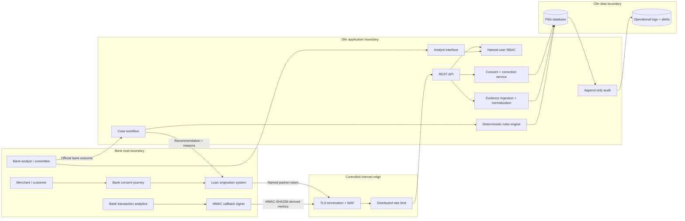
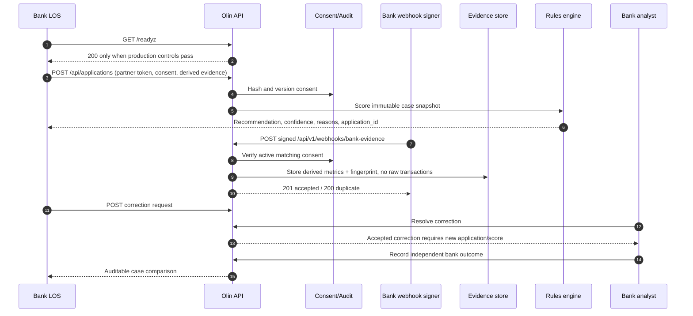
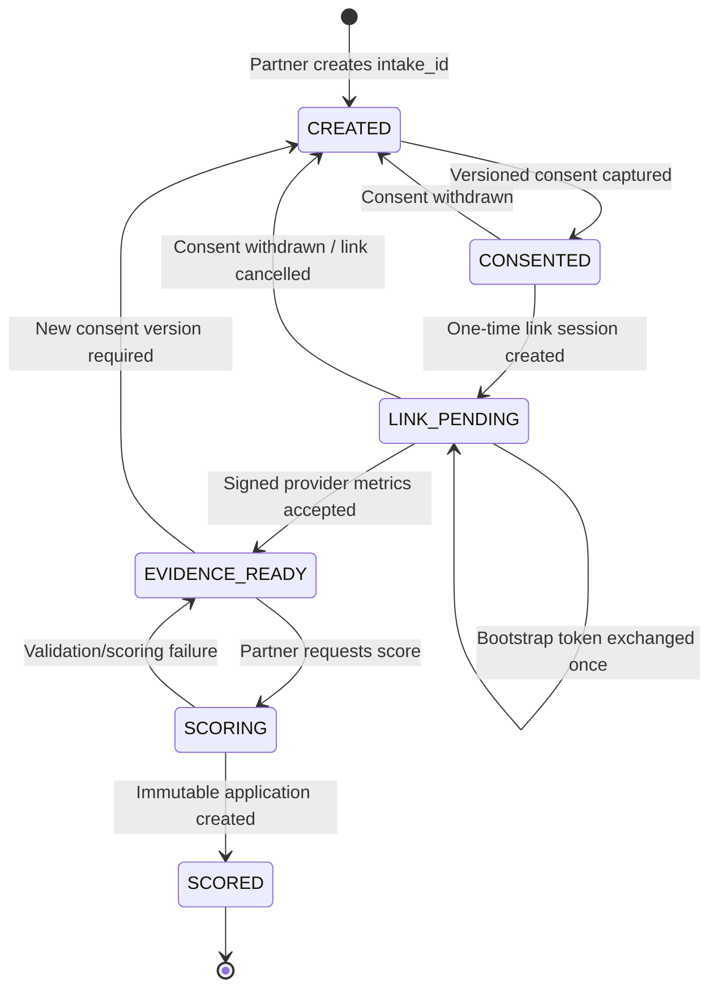
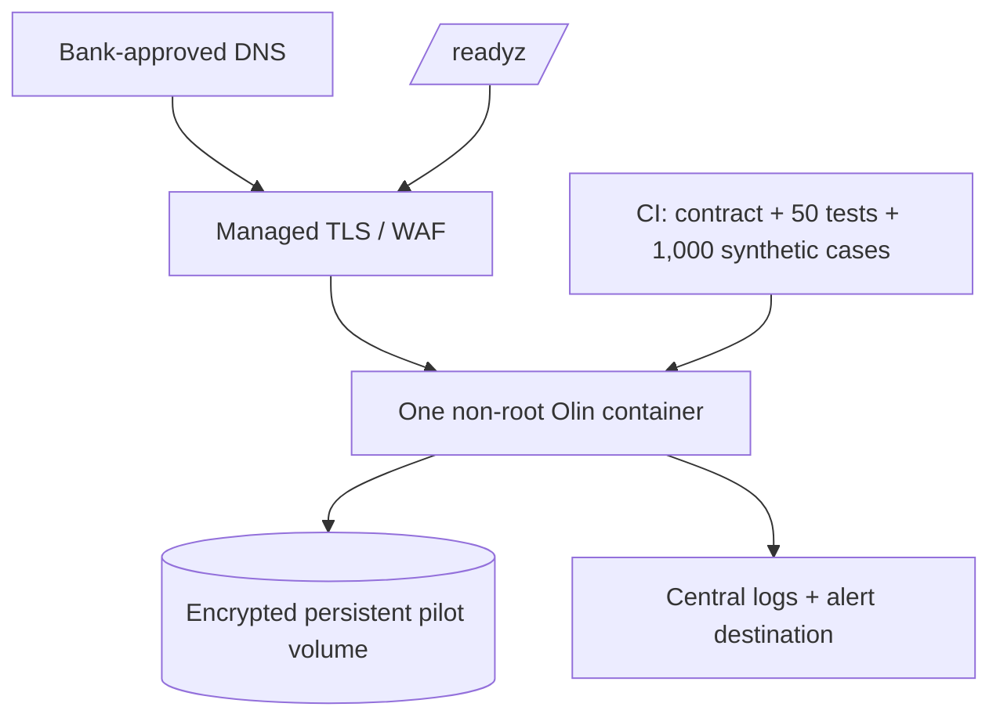

# Olin bank integration architecture

Status: controlled shadow-pilot architecture, 20 August 2026.

## Executive decision

Keep Olin as a modular monolith for the first bank and ten-case cohort. The
bank remains system of record for identity, official credit decision and
funding. Olin receives consented, derived evidence, produces an explainable
recommendation, and records the bank's independent outcome. No Olin component
can move money in the shadow deployment.

This is the smallest architecture that can be operated by a small team and
reviewed by a bank. Microservices, Kafka and Kubernetes add failure modes
without improving the first integration.

## System context

## Bank integration sequence

## Hosted-linking state machine

Only `EVIDENCE_READY` can enter scoring. An atomic state claim prevents two
requests from creating two applications. If validation fails, the intake
returns to `EVIDENCE_READY` without losing consent or evidence.

## Supported integration modes

### 1. Bank-orchestrated scoring — use for the first pilot

The bank already owns the customer relationship and transaction data. It
computes or maps the agreed derived metrics, captures consent, and submits the
shadow case using a named `partner` credential. This is the complete,
production-tested path today.

### 2. Signed evidence reconciliation

The bank can send later or refreshed derived metrics to the HMAC callback. The
event is consent-bound, fresh, idempotent and retrievable. It never changes an
existing score. A material update or accepted correction creates a new case.

### 3. Olin-hosted account linking — state machine implemented

Olin now creates a random `intake_id` before scoring, hashes versioned consent,
issues a one-time link token, enforces a 5–30 minute session, accepts signed
evidence against the intake, and converts an evidence-ready intake into exactly
one immutable case. Consent withdrawal cancels the live session immediately.

The provider-neutral state machine and sandbox contract are ready. A real
Syncfy or bank widget still requires that provider's commercial credentials,
SDK and callback mapping; Olin never collects bank passwords itself.

## Data contract and ownership

| Data | System of record | Stored by Olin | Rule |
|---|---|---:|---|
| Merchant identity | Bank | Case snapshot | Minimize; partner-scoped access |
| Consent wording | Bank/Olin approved version | SHA-256 + version + channel + actor | Append-only; withdrawal blocks ingestion |
| Raw bank transactions | Bank | No | Never send to Olin pilot |
| Derived bank metrics | Bank | Yes | Signed, bounded, fresh, consent-bound |
| Olin recommendation | Olin | Yes | Explainable and immutable per case |
| Official credit decision | Bank | Comparison outcome only | Bank remains decision owner |
| Disbursement | Bank | No shadow movement | Olin route stays disabled |

## Security architecture

- TLS at the edge; plaintext is allowed only for localhost acceptance tests.
- Named credentials and partner ownership isolation on every case route.
- Separate partner, analyst and admin duties; partners cannot resolve their own
  corrections and only admin can reach the money-movement permission.
- HMAC-SHA256 signature over the exact webhook body, freshness window and
  idempotent `event_id`.
- Random 256-bit link tokens stored only as SHA-256 hashes, exchanged once and
  bounded to a 5–30 minute session.
- Versioned consent hash, explicit withdrawal and immutable audit events.
- Request-size bounds, metric allowlist, no raw transactions, no CLABE and no
  credentials in the bank callback.
- CSP, clickjacking protection, no-store, no-sniff and memory-only browser
  access tokens.
- `/readyz` fails closed if duties, secret, database or shadow-money control is
  missing.
- Production secrets belong in the hosting secret manager, never `.env`, Git,
  browser code, logs or acceptance reports.

## Deployment for the first bank

One application instance and SQLite are acceptable only for the ten-case,
single-bank shadow cohort with encrypted storage and tested backups. Before a
second bank or concurrent writers, migrate the same schema to managed
PostgreSQL. Do not add microservices during this migration.

## Reliability objectives

- Availability target: 99.5% during agreed pilot business hours.
- API p95 target: under 1 second excluding external evidence providers.
- Recovery target: RTO 4 hours, RPO 24 hours for shadow-pilot data.
- Alert immediately on readiness failure, repeated invalid signatures, database
  write failure or any attempted shadow disbursement.
- Every alert must link to an operator runbook and named owner.

## Path to 10× volume

1. Managed PostgreSQL with encrypted backups and restore drills.
2. Managed identity/OIDC with short-lived sessions and bank SSO if required.
3. Gateway-level distributed rate limiting and IP/mTLS policy per bank.
4. Durable webhook queue with dead-letter handling for provider bursts.
5. KMS-backed per-bank signing keys and automated rotation.
6. Structured metrics for latency, errors, saturation and case throughput.
7. Connect the implemented `intake_id` adapter to the selected commercial
   provider and run its certification suite.

## Go/no-go decision

The code is suitable for a bank sandbox and a controlled shadow cohort when the
acceptance suite passes in the bank's environment. The hosted-linking state
machine is implemented, but the real provider widget is an external
certification dependency. Public origination, automated final decisions and
real-money movement remain separate launch gates, not configuration toggles.
