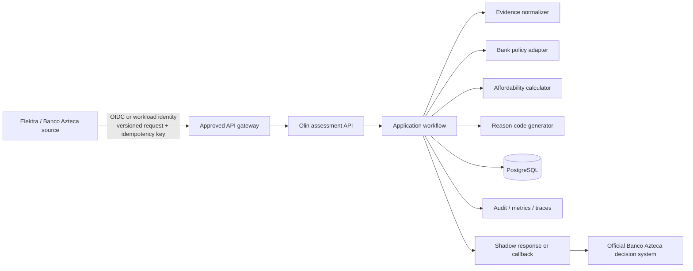

# Olin × Elektra technical recovery plan

**Decision date:** 1 September 2026  
**Target:** Technical evaluation build ready for Elektra review in seven calendar days  
**Status:** Execution baseline — supersedes broader “full lending platform” positioning for this evaluation

## Executive decision

Olin is not ready for production use at Elektra today. It can, however, become a credible technical-evaluation build in one focused week if the team freezes the product boundary and proves one end-to-end use case from a clean, reproducible repository.

The week-one product is:

> An evidence and affordability decision-support adapter for an existing Banco Azteca customer purchasing business-use equipment through Elektra Mi Negocio. Olin returns missing-evidence, affordability and reason-code support; Banco Azteca remains the sole official decision maker.

This is the narrowest proposition that fits Elektra's public retail/financial-services model and avoids making unsupported claims about predictive lift. Grupo Elektra reports an integrated retail and financial-services footprint, more than 4,800 contact points in Mexico, 28.3 million digital customers in Q1 2026, and a focus on a consistent credit-origination model across physical and digital channels. Elektra's Mi Negocio catalogue provides a plausible business-equipment journey, while Préstamo Elektra is a Banco Azteca Credimax product. These facts support discovery of the proposed cohort; they do not prove that Elektra needs Olin.

## What “ready next week” means

### Included

- A clean branch and tagged, reproducible container image.
- One versioned OpenAPI contract with synthetic Elektra-shaped requests.
- PostgreSQL-native storage and reviewed migrations.
- An idempotent assessment workflow with immutable audit events.
- A bank-owned policy adapter; thresholds are configuration, not Olin product claims.
- Structured logs, metrics, traces, health checks and correlation IDs.
- Security, threat-model, data-flow and runbook documentation.
- A deterministic end-to-end test and a 15-minute technical demonstration.
- A model-development protocol and historical-data contract.

### Not included

- Production customer traffic or unrestricted real-data ingestion.
- Autonomous approval, decline, credit-line change, disbursement or collections.
- A validated predictive credit model.
- Direct customer KYC, bank-credential collection or open-banking credential custody.
- Replacement of Banco Azteca's decision engine or employee identity system.

The release is ready for **sandbox technical evaluation**, not production. Production approval remains conditional on Elektra's architecture, security, privacy, credit-risk, model-risk and operational gates.

## Product contract

### Trigger

An Elektra/Banco Azteca system sends an authorized shadow-assessment request for a bank-defined cohort. Public checkout and the Olin waitlist cannot invoke this service.

### Minimum request

- Pseudonymous customer, application and credit-line references.
- Cart/SKU, price, category and declared business purpose.
- Bank-approved derived repayment/history features.
- Bank-approved derived income or cash-flow features when available.
- Policy version and bank correlation identifier.

Raw credentials, unnecessary identity documents, biometric data and payment instructions are prohibited from the week-one service.

### Response

- Assessment, trace and policy-version identifiers.
- Route: `INSUFFICIENT_EVIDENCE`, `MANUAL_REVIEW`, or `EVIDENCE_SUPPORTED_REVIEW`.
- Affordability calculation under bank-defined assumptions.
- Machine-readable reason codes and missing-evidence alternatives.
- Evidence provenance summary.
- `decision_support_only=true` and `official_decision_required=true`.

The API must never return `APPROVED` or `DECLINED` in this phase.

## Target architecture



### Architecture style

Use an API-first modular monolith. Microservices would add deployment and observability burden without reducing the present concentration risk. The legacy application remains quarantined while the Elektra vertical slice is extracted into a new service boundary.

Recommended package layout:

```text
services/elektra-assessment/
  src/olin_elektra/
    api/                 # HTTP schemas, auth dependencies, error contract
    application/         # commands, queries, state transitions
    domain/              # assessment, evidence, policy, reason codes
    adapters/
      persistence/       # SQLAlchemy repositories
      identity/          # OIDC/workload identity boundary
      elektra/           # source and callback contracts
    observability/       # logs, metrics, traces
    settings.py
  migrations/            # Alembic only
  tests/                 # unit, contract, integration, security
  Dockerfile
  pyproject.toml
```

### Baseline technology

- Python 3.12, FastAPI and Pydantic v2.
- SQLAlchemy 2, Alembic and PostgreSQL 16.
- Elektra-approved OIDC/OAuth2 or workload identity; a sandbox verifier only for local tests.
- OpenTelemetry-compatible instrumentation and structured JSON logs.
- `pytest`, `ruff`, `mypy`, coverage enforcement, API contract tests and migration tests.
- Secret, dependency, static-analysis and container-image scanning in CI.
- Docker/OCI packaging, deployable to Elektra's approved runtime. No cloud provider is assumed.

### Authoritative data records

1. `assessment_request`: immutable normalized request and source reference.
2. `evidence_reference`: type, provenance, freshness, authority and permitted-use metadata; raw documents are outside the service by default.
3. `policy_version`: immutable bank-owned rules and effective dates.
4. `assessment_result`: capacity, route, reasons and limitations.
5. `audit_event`: append-only actor, action, timestamp, trace, before/after references.
6. `bank_outcome`: official decision, override reason, delinquency label and observation window returned by Elektra.

Every write uses an idempotency key, actor identity, transaction boundary and trace ID. Every state transition is explicit and replay-safe.

## Seven-day execution plan

### Day 1 — Freeze, contract and clean build

**Owner:** Senior backend/architecture lead  
**Output:** One reviewable repository boundary

- Freeze new features and name the week-one product and non-goals.
- Create a clean Elektra service branch containing only required code, tests and infrastructure.
- Commit the request/response schema, reason-code catalogue and three architecture decisions.
- Add `pyproject.toml`, lock dependencies and make CI build from a clean clone.
- Create a synthetic Elektra fixture and golden response.

**Gate:** Another engineer can clone, build, test and run the service without local files.

### Day 2 — Domain workflow and PostgreSQL

**Owner:** Backend engineer  
**Output:** Deterministic state machine and database lifecycle

- Implement assessment states and transition invariants.
- Add SQLAlchemy models and the initial Alembic migration.
- Add migration upgrade/rollback/upgrade testing against PostgreSQL.
- Implement repositories with transaction boundaries and append-only audit events.

**Gate:** Duplicate requests produce one assessment; the complete event history can reconstruct it.

### Day 3 — Policy and evidence vertical slice

**Owner:** Credit-domain engineer with Elektra credit owner  
**Output:** One end-to-end assessment

- Extract only reviewed evidence normalization and capacity calculations from the prototype.
- Represent thresholds as a versioned Elektra policy configuration.
- Implement missing-evidence alternatives and reason codes.
- Prohibit approval/decline language at schema and test levels.

**Gate:** Golden request produces the deterministic golden response and policy version.

### Day 4 — Identity, authorization and observability

**Owner:** Security/DevSecOps engineer  
**Output:** Enterprise integration boundaries

- Add issuer/audience/signature validation for sandbox tokens and adapter points for Elektra identity.
- Enforce roles and tenant/customer isolation at the application and repository layers.
- Add correlation IDs, structured logs, spans, RED metrics and security-event logging.
- Produce the threat model and data-flow diagram.

**Gate:** Missing/invalid identity, cross-customer access and replay attempts fail safely and are audited.

### Day 5 — CI, container and contract demonstration

**Owner:** QA/DevSecOps engineer  
**Output:** Reproducible signed evaluation artifact

- Add formatting, lint, typing, unit/integration/contract tests and coverage threshold.
- Add secret, dependency, SAST and container scans; fail on unresolved critical/high findings.
- Build an OCI image, SBOM and checksum from CI.
- Publish OpenAPI and a Postman/cURL evaluation collection.

**Gate:** Clean CI produces the same artifact and all acceptance evidence.

### Day 6 — Failure, recovery and operator proof

**Owner:** Operations owner  
**Output:** Runbook and failure evidence

- Test database/provider timeout, malformed event, duplicate request and callback ambiguity.
- Demonstrate alert, assignment, acknowledgement, resolution and kill switch.
- Test backup/restore in the selected evaluation environment.
- Capture latency/error/load baseline; do not invent a production SLO.

**Gate:** An operator can diagnose and recover a failed synthetic assessment from the runbook.

### Day 7 — Elektra review pack

**Owner:** Product/engagement lead  
**Output:** 15-minute technical review

- Demonstrate one request, assessment, audit reconstruction and official-decision separation.
- Present architecture, data minimization, threat model, CI evidence and known limitations.
- Agree the historical-data schema, owners and next approval gates.
- Record every question and decision in the project memory.

**Gate:** Elektra accepts, requests changes or stops the evaluation against explicit criteria.

## Model-development plan

### Current truth

Olin currently has an explainable rules scorecard. It is not a trained or independently validated Elektra credit model. Ten cases can validate workflow usability; they cannot establish predictive quality. A fixed claim such as “train XGBoost after 200 loans” must be removed: sample adequacy depends on outcome prevalence, segment coverage, horizon and statistical precision—not an attractive round number.

### Data contract before training

Elektra's credit owner and model-risk function must define:

- Unit of observation and eligible population.
- Official outcome label, such as delinquency threshold and observation horizon.
- Application, decision, override and repayment timestamps.
- Accepted, rejected, withdrawn and incomplete-case treatment.
- Feature availability timestamp to prevent future-data leakage.
- Permitted variables, retention, lawful use and deletion/withdrawal handling.
- Historical policy changes, campaigns and channel changes.

### Development protocol

1. Profile completeness, validity, representativeness, duplicates and label maturity.
2. Freeze a temporal split: development, validation and out-of-time test. Keep the same customer in only one split.
3. Establish an interpretable logistic-regression/scorecard baseline.
4. Add a monotonic gradient-boosted challenger only if the data and governance support it.
5. Evaluate discrimination (ROC-AUC/Gini/KS), calibration (curves, Brier/log loss), coverage, expected-loss/business outcomes, stability and missingness.
6. Review proxies, segment behavior, adverse impacts and operational failure modes under Mexican legal/compliance guidance.
7. Document feature lineage, limitations, reason mapping and reproducibility in a model card.
8. Require independent validation and bank approval before any decision use.
9. Monitor input drift, score/route distribution, calibration, overrides, outcomes and provider failure; define recalibration and stop thresholds.

Synthetic and public datasets may test pipelines only. They cannot validate performance for Banco Azteca customers. Vendor or external data must be demonstrated as predictive for the bank's borrowers and operations.

## Security and privacy position

Mexican personal-data law requires lawful, informed and controlled processing. Credit-report access requires the relevant authorization. The week-one service therefore uses synthetic data only and stores pseudonymous references plus permitted derived features. Elektra must approve the controller/processor roles, purpose, field inventory, retention, transfer terms and incident process before real data enters any environment.

Required technical controls for historical validation include encryption in transit/at rest, least privilege, Elektra-approved identity, segregated environments, field-level logging prohibition, secret management, data retention/deletion jobs, access review and incident evidence.

## Owners required now

### Olin

- **Technical lead:** architecture, code review, clean release and integration decisions.
- **Backend engineer:** domain workflow, API, PostgreSQL and tests.
- **QA/DevSecOps engineer:** CI, security gates, container, observability and recovery.
- **Product/engagement lead:** scope, acceptance, demo and decision log.
- **Credit/model advisor:** label, features, metrics and model documentation.

### Elektra/Banco Azteca

- Product owner for the exact customer journey.
- Credit-policy owner and model-risk validator.
- Integration architect and identity/security contacts.
- Privacy/legal reviewer and data owner.
- Operations/UAT owner.

Without these named Elektra owners, the build remains a demonstration and must not consume real data.

## Go/no-go scorecard for the review

The build passes only if all are true:

- Clean clone, locked dependencies, CI evidence and tagged artifact exist.
- One synthetic Elektra event succeeds end to end with trace, idempotency and audit reconstruction.
- PostgreSQL migrations upgrade and roll back in CI.
- Identity, authorization, data minimization and tenant/customer isolation tests pass.
- No unresolved critical/high secret, dependency, static-analysis or container finding.
- API language and runtime controls prevent Olin from making an official credit decision.
- Threat model, runbook, known limitations and rollback evidence are present.
- The historical-data contract and approval owners are identified.

Any failed item is a documented blocker, not something hidden during the demonstration.

## Immediate decisions for the founder

1. Freeze the waitlist, autonomous lending, KYC, disbursement and collections work for this week.
2. Appoint one technical lead with authority to reject scope.
3. Make the Elektra evidence/affordability adapter the only supported evaluation product.
4. Ask Elektra for the exact journey, architecture standards, identity pattern and five named owners.
5. Present next week's artifact as a technical evaluation build and request a historical-validation workstream—not production approval.

## Sources

- [Grupo Elektra Q1 2026 presentation](https://www.grupoelektra.com.mx/Documents/ES/Downloads/Grupo_Elektra_1T26_Espa%C3%B1ol.pdf)
- [Grupo Elektra company overview](https://www.grupoelektra.com.mx/es/nosotros)
- [Elektra Mi Negocio](https://www.elektra.mx/mi-negocio)
- [Préstamo Elektra / Banco Azteca Credimax](https://www.elektra.mx/prestamo-elektra)
- [CNBV, Anexo 15 de la Circular Única de Bancos](https://www.cnbv.gob.mx/Anexos/Anexo%2015%20CUB.pdf)
- [Diario Oficial de la Federación — capacidad predictiva de modelos](https://dof.gob.mx/nota_detalle_popup.php?codigo=5138193)
- [Basel Committee — expected credit loss model validation](https://www.bis.org/committees/bcbs/basel-consolidated-guidelines/module/pap/20)
- [Basel Committee — vendor models and portfolio testing](https://www.bis.org/committees/bcbs/basel-consolidated-guidelines/module/cri/30)
- [Federal Reserve — Supervisory Guidance on Model Risk Management, revised 2026](https://www.federalreserve.gov/frrs/guidance/supervisory-guidance-on-model-risk-management.htm)
- [NIST AI RMF Core](https://airc.nist.gov/airmf-resources/airmf/5-sec-core/)
- [scikit-learn — probability calibration](https://scikit-learn.org/stable/modules/calibration.html)
- [Ley Federal de Protección de Datos Personales en Posesión de los Particulares](https://www.diputados.gob.mx/LeyesBiblio/pdf/LFPDPPP.pdf)
- [Círculo de Crédito — authorization for a credit report](https://www.circulodecredito.com.mx/b/guia-de-mi-reporte-de-credito-especial)
- [World Bank — alternative data transforming SME finance](https://documents1.worldbank.org/curated/en/701331497329509915/pdf/116186-WP-AlternativeFinanceReportlowres-PUBLIC.pdf)

## Research limitations

This report uses public information and a local code audit. It does not contain Elektra's internal architecture, credit policy, data dictionary, loss outcomes, security standards or procurement requirements. Product fit is therefore a testable hypothesis. Legal conclusions require review by qualified Mexican counsel, and model approval belongs to Banco Azteca's accountable risk functions.
